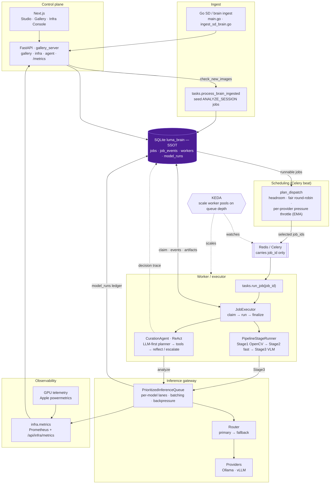

# Livehouse Photography Agent


**Domain:** concert / Livehouse photo workflows — preview ingestion, multi-stage quality gates, VLM scoring with bilingual commentary, and static galleries.

**Systems angle:** this repo doubles as a **small job-centric AI-infra slice**. SQLite is the execution source of truth (`jobs`, `job_events`, `workers`, model-run ledger); Celery only carries task envelopes (`tasks.run_job(job_id)`); and FastAPI exposes both the gallery APIs and an **infra control plane** (metrics, timelines, worker controls). The photography pipeline is the *application* built on that substrate.

---

## Why this repo exists (portfolio framing)

- **Durable execution model:** claim / retry / dead-letter live in SQL; Celery `AsyncResult` is not authoritative.
- **Observability baked in:** `job_events` timelines, trace grouping, optional Prometheus (`GET /metrics`), consolidated infra metrics (`GET /api/infra/metrics`), and live **GPU telemetry** on Apple Silicon.
- **Operator UX:** a Next.js **Infra Console** (`/infra`) over the same APIs the executor uses — not a parallel stack.
- **Pluggable inference:** optional `inference/` router + providers vs. the legacy in-process `LivehouseVLM` (`model.use_inference_layer` in `configs/livehouse.yaml`).

---

## Recent changes

- **Apple-Silicon GPU telemetry** (`infra/gpu_telemetry.py`): a non-root API reads real `powermetrics` GPU readings (HW active residency / frequency / power) written by a separate `sudo` sampler (`scripts/gpu_telemetry_sampler.py`) to a small atomic JSON file. Readers degrade gracefully (stale → busy-time estimate) and never raise. Surfaced in `infra/metrics.py` and the Infra Console serving panel.
- **"Squeeze the GPU" demo** (`scripts/gpu_pressure_demo.py`): runs the same image batch **serial vs. concurrent** through the real inference stack, samples GPU utilization during each phase, and emits a JSON document + dependency-free SVG comparing the two GPU curves and the speedup factor. Supports `--simulate` when no model is available.
- **Infra Console refresh:** decode throughput / serving panels (`web/components/infra/*`) and `api/infra_routes.py` cost/token reporting updated.
- **Repo hygiene for public release:** demo photos and a stray DB backup were removed from the repo (kept locally, outside VCS), machine-specific absolute paths were redacted to relative paths, and `.gitignore` now blocks `*.bak` / `*.db.bak*` and the demo-photo directories. Long-form design docs are maintained outside the repo.

---

## Architecture (recommended main path)

### System map

SQLite is the **single source of truth**; Celery is a dumb transport that carries only a `job_id`; the scheduler throttles by live provider pressure; the curation agent is an LLM-first ReAct loop; and the VLM only ever runs through a bounded inference queue.



### Linear main path

Production and SD/brain ingest follow **one** chain (SQLite `jobs` / `job_events` = SSOT; Celery carries only `job_id`):

```text
ingest (Go SD/brain → sessions/photos)
  → POST /api/ingest/check_new_images
  → tasks.process_brain_ingested          # seed ANALYZE_SESSION jobs
  → tasks.run_job(job_id)
  → services.job_executor.JobExecutor
  → services.processor.pipeline_stage_runner.PipelineStageRunner
  → inference (LivehouseVLM or the inference/ layer)
  → artifacts (analysis_results.json, job_events, success payload on jobs)
```

Manual / API analyze: `POST /api/tasks/analyze`, or insert a `jobs` row and `send_task("tasks.run_job", [id])` — the same executor chain from `run_job` onward.

| Layer | Meaning | Start here |
|------|---------|------------|
| **Main path** | Jobs + events as SSOT; worker rows + heartbeat; executor claims by `job_id` and runs `PipelineStageRunner`. | `tasks/run_job.py` → `services/job_executor.py` → `services/processor/pipeline_stage_runner.py` |
| **Dispatch & ingest** | SD / brain path seeds `ANALYZE_SESSION` rows and dispatches `run_job` by id. | `tasks/ingest.py`, `services/scheduler/` |
| **Stage-aware jobs** | Optional linear DAG of `PIPELINE_STAGE` rows linked by `depends_on_job_id`. | `services/pipeline_stages.py`, `services/job_executor.py` |
| **HTTP surface** | Gallery + task submission + infra; health `GET /healthz`, metrics `GET /metrics`. | `gallery_server.py`, `api/gallery_routes.py`, `api/infra_routes.py` |
| **Infra UI** | Live console for jobs / workers / providers / metrics / GPU. | `web/app/infra/page.tsx` |
| **Optional inference swap** | `model.use_inference_layer: true` → `inference/` (client, router, ledger, registry). | `configs/livehouse.yaml`, `inference/` |

---

## Features (current code)

- **Pipeline stages:** OpenCV gates → fast aesthetic metrics → VLM structured JSON (with an optional single-flight queue / graceful degradation).
- **Job platform:** `jobs` status machine, append-only `job_events`, `trace_id` correlation, artifacts on success rows, manual retry / cancel via the infra API.
- **Workers:** SQLite `workers` registration, `WorkerManager` heartbeat (+ `long_task_heartbeat` during long runs); pause / drain / resume; logical pools via `LIVEHOUSE_EXECUTOR_CLASS`.
- **Agentic curation:** LLM-first ReAct loop (`services/agent/`) with a rich tool surface — `inspect`, `analyze`, plus zero-cost planning tools `compare` (tie-break), `cluster` (group burst frames → analyze one representative per burst), and `query_gallery` (recall a prior score instead of re-analyzing) — heuristic fallback on unusable output.
- **Inference layer (optional):** provider registry, primary/fallback routing, attempts ledger, latency / fallback counters in `infra.metrics`.
- **GPU telemetry & demos:** real Apple-Silicon GPU readings, a serial-vs-concurrent throughput demo, and an end-to-end **load → backpressure → throttle → KEDA scale** control-loop demo (`scripts/infra_scaling_demo.py`, driving the real dispatch-throttle engine + KEDA formula).
- **Gallery:** `analysis_results.json`, FastAPI `/image`, Next.js gallery and **Infra** pages.

---

## Requirements

- **Python** 3.10+, **Redis** (Celery broker), **Node.js** 18+ (`web/`).
- **Ollama** (or a compatible HTTP API) for the VLM — see `configs/livehouse.yaml` → `model.*`.
- Optional: **Go** 1.22+ for ingest; **exiftool** for RAW previews; macOS `powermetrics` (`sudo`) for real GPU telemetry.

---

## Quick start

```bash
python -m venv .venv && source .venv/bin/activate   # Windows: .venv\Scripts\activate
pip install -r requirements.txt
cp .env.example .env                                # fill in only what you need; never commit .env
```

1. Edit **`configs/livehouse.yaml`** (`paths.source_dir`, `model.*`, optional `model.use_inference_layer`).
2. **Full stack (recommended):** `./start_all.sh` (Redis, Celery worker, FastAPI, Next.js, jobs SSOT).
   Docker, multi-service on one machine: `./deploy/up.sh up --build`.
3. **Compatibility only (no jobs / no Infra timeline):**
   `python run_pipeline.py --config configs/livehouse.yaml --source-dir "<your-previews-dir>" --no-serve`
4. **URLs:** Next.js <http://127.0.0.1:3000> (open **`/infra`** for the console); FastAPI <http://127.0.0.1:8080> (`/api/gallery/results`, `/api/infra/metrics`, `/healthz`, `/metrics`).

Copy `web/.env.example` → `web/.env.local`; set `NEXT_PUBLIC_API_BASE` if the API host/port differs.

### Optional: GPU telemetry & the throughput demo

```bash
# Real Apple-Silicon GPU readings (root sampler; writes an atomic JSON the API reads):
sudo python scripts/gpu_telemetry_sampler.py &

# Serial vs concurrent VLM batch — emits JSON + SVG with the speedup:
python scripts/gpu_pressure_demo.py --images-dir "<your-jpegs-dir>" --count 24 --workers 4
# No model handy? shape-preview with injected latency:
python scripts/gpu_pressure_demo.py --simulate --count 24 --workers 4
```

---

## Configuration

| Area | Where |
|------|------|
| Paths, thresholds, VLM / inference toggle | `configs/livehouse.yaml` |
| Celery broker / backend | `CELERY_BROKER_URL`, `CELERY_RESULT_BACKEND` |
| Worker pool label (Celery process) | `LIVEHOUSE_EXECUTOR_CLASS` (default `general`) |
| GPU telemetry file path | `LUMA_GPU_TELEMETRY_PATH` (default: temp dir) |
| Brain DB / archive roots | `LUMA_BRAIN_DB`, `LUMA_ARCHIVE_ROOT` (see `.env.example`) |

All secrets and machine-specific paths belong in `.env` (git-ignored). `.env.example` documents the keys with placeholders only.

---

## Evaluation (Stage3 vs. human ground truth)

The Stage3 scorer is evaluated against human labels — Spearman / Pearson / MAE on `overall`, per-dimension MAE, and selection precision/recall@k:

```bash
# 1. Build a stratified eval set from archived sessions (250 imgs across score deciles)
python scripts/eval/sample_eval_set.py --session "<archive>/<YYYY-MM-DD>" \
    --target 250 --out data/eval/images --manifest data/eval/manifest.json

# 2. Run Stage3 with admission gates opened (production model params)
python run_pipeline.py --config configs/eval_stage3.yaml --source-dir data/eval/images --no-serve --no-checkpoint

# 3. Label ground truth in a local web UI
python scripts/label_server.py --images data/eval/images --labels data/eval/labels.jsonl

# 4. Score AI vs. labels
python scripts/eval_stage3.py run --labels data/eval/labels.jsonl \
    --predictions data/eval/images/analysis_results.json
```

Prompt iterations are versioned in `services/processor/stages/stage3_prompt_registry.py` and compared on the same fixed eval set.

### Agent evaluation (planner)

The curation loop is **LLM-first** (the model drives analyze/finalize; the deterministic `HeuristicPlanner` is the fallback). Two harnesses grade it:

- **Selection quality vs. human labels** — `scripts/eval/eval_agent_selection.py`: under a fixed VLM budget, does a planner (`heuristic` / `random` / `oracle` / `llm`) analyze and keep the photos a human would? Headline: `analyzed_keeper_recall` + precision/recall@k.
- **Trajectory / behavior (label-free)** — `scripts/eval/eval_agent_trajectory.py`: how a planner *spends* its budget — budget utilization, `llm_decision_rate` (fraction of decisions the model drove) and heuristic `fallback_rate`, reflection escalations, steps, and wall-clock — reported as mean ± std over `--repeats`, with a head-to-head delta vs a baseline. Runs fully offline on synthetic candidates (`--synthetic N`) or a real Stage2 manifest (`--features`):

```bash
python scripts/eval/eval_agent_trajectory.py --synthetic 120 --budget 20 --repeats 3
# add --llm to also grade the real LLM planner (needs the configured provider)
```

---

## Go ingest tools (optional)

Same session layouts as before (classic `RAW/` + `Previews/`, or flat RAW):

| Command | Role |
|---------|------|
| `go run -tags=tools preview_extractor.go ...` | ARW → `Previews/*.jpg` |
| `./ingest_worker --archive-root ...` (or SD mode with `--sd-mount`) | Mode **A**: subprocess pipeline; Mode **B**: SQLite brain + `POST .../check_new_images` → `tasks.process_brain_ingested` → job seed + `tasks.run_job` |

Placeholders for `--pipeline-cmd`: `{session_dir}`, `{previews_dir}`, `{raw_dir}`, `{archive_root}`, `{session_name}`.

---

## Project layout (short)

```text
configs/        # livehouse.yaml and friends
tasks/          # run_job, ingest, maintenance, misc (legacy task)
services/       # job_executor, job_lifecycle, processor/, scheduler/, ...
engine/         # default LivehouseVLM; operators; culler helpers
inference/      # optional inference layer (router, providers, ledger)
infra/          # WorkerManager, metrics, health, gpu_telemetry
api/            # gallery_routes, infra_routes
gallery_server.py   # FastAPI app + /healthz + /metrics
web/            # Next.js; /infra = Infra Console
utils/          # config, luma_brain (SQLite), logging, json_safe
scripts/        # benchmarks, eval harness, GPU telemetry sampler + demo
data/           # eval/ (labels + manifest), fixtures/ (raw/ is local-only)
*.go            # main.go, ingest_*.go, luma_brain*.go, preview_extractor.go
```

---

## Editor conventions

See `.cursor/rules/*.mdc`.

## License

[MIT](LICENSE) © postrockicecola
