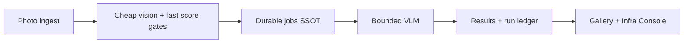

# Livehouse Photography Agent


> A **job-centric AI runtime** for vision workflows: durable job state machines for VLM inference, with backpressure, fallback, a run ledger, and an operator console so work is recoverable, observable, and evaluable.

Livehouse photography is the real business load — not an abstract framework demo. The core is not “call a vision model to score photos,” but putting expensive, flaky model calls inside a recoverable, observable, evaluable job system.

```text
Photo ingest
  → cheap vision gates
  → durable job system
  → bounded VLM inference
  → model / run ledger
  → Gallery / Infra Console
```

Agent curation, KEDA, Operator, RLHF, and prompt labs are **Infra Experiments** (extensions). They are not co-equal with the main path.

---

## Product value (what interviewers see first)

| Input | Output |
|------|--------|
| A Livehouse session of similar concert frames | Filtered set, scores, bilingual commentary, dedupe, Gallery export |

Surfaces:

- **Studio** — submit / browse sessions
- **Infra Console** (`/infra`) — jobs, timelines, model attempts, workers, cost
- **Gallery** — human confirm + export

> **Demo video (Batch B):** a 60–90s walkthrough will land here. Until then, open `/studio` → `/infra` → `/gallery` on a local full stack, or the read-only Vercel deploy labeled **Showcase Fixture**.

### Data provenance labels

Every metric and chart should carry one of:

| Label | Meaning |
|------|---------|
| **Live** | From the currently running local system |
| **Recorded Run** | Real, reproducible historical run / archive snapshot |
| **Simulated** | Shape demo or injected latency — not a production measurement |
| **Showcase Fixture** | Committed static snapshot for the read-only deploy |

Do not present Simulated or Showcase Fixture numbers as live production SLOs.

---

## Why this is not a typical AI demo

Four sells on the main path:

- **Durable Jobs** — claim / retry / dead-letter live in SQL; Celery `AsyncResult` is not authoritative
- **Bounded Inference** — prioritized queue, concurrency + backpressure limits
- **Model Fallback** — primary → fallback routing with attempt ledger
- **End-to-end Observability** — `job_events`, `model_runs` / attempts, Infra Console drill-down



### Linear main path

```text
ingest (Go SD/brain → sessions/photos)
  → POST /api/ingest/check_new_images
  → tasks.process_brain_ingested          # seed ANALYZE_SESSION jobs
  → tasks.run_job(job_id)
  → services.job_executor.JobExecutor     # atomic claim → run → finalize
  → PipelineStageRunner                   # Stage1 OpenCV → Stage2 fast → Stage3 VLM
  → PrioritizedInferenceQueue + router    # primary → fallback
  → artifacts (analysis_results.json, job_events, model_runs)
```

Celery carries only a `job_id`. SQLite (`jobs`, `job_events`, `workers`, model-run ledger) is the execution source of truth.

| Layer | Meaning | Start here |
|------|---------|------------|
| **Main path** | Jobs + events as SSOT; executor claims by `job_id` | `tasks/run_job.py` → `services/job_executor.py` → `services/processor/pipeline_stage_runner.py` |
| **Dispatch & ingest** | Seed `ANALYZE_SESSION` and dispatch by id | `tasks/ingest.py`, `services/scheduler/` |
| **HTTP surface** | Gallery + tasks + infra | `gallery_server.py`, `api/` |
| **Infra UI** | Operator console over the same APIs | `web/app/infra/page.tsx` |
| **Optional inference swap** | `model.use_inference_layer: true` → `inference/` | `configs/livehouse.yaml` |

---

## Job walkthrough (showcase)

On Infra Console, expand a representative `ANALYZE_SESSION` job:

```text
QUEUED → CLAIMED → PREPROCESSING → INFERENCING → SUCCEEDED
```

Then drill into inference:

```text
queue wait → primary provider → fallback (if any) → token / latency / cost → artifact
```

> **Batch B:** default open a real success job + a timeout→fallback→degraded success case, plus a Guided Tour. Showcase fixtures already ship under `web/fixtures/`.

---

## Evaluation

Fixed **250-image** human-labeled set (`data/eval/`). Stage3 reports Spearman / Pearson / MAE and selection precision/recall@k. Agent harnesses compare planners under a fixed VLM budget.

```bash
python scripts/eval/sample_eval_set.py --session "<archive>/<YYYY-MM-DD>" \
    --target 250 --out data/eval/images --manifest data/eval/manifest.json
python run_pipeline.py --config configs/eval_stage3.yaml --source-dir data/eval/images --no-serve --no-checkpoint
python scripts/label_server.py --images data/eval/images --labels data/eval/labels.jsonl
python scripts/eval_stage3.py run --labels data/eval/labels.jsonl \
    --predictions data/eval/images/analysis_results.json
```

Raw reports live under `reports/eval/` (**Recorded Run** JSON; not yet a polished comparison page — Batch C).

**Agent honesty:** the curation runtime has budget caps, tools, and behavior eval; quality gains have **not** stably beaten the heuristic baseline. Treat Agent as an Infra Experiment until that changes.

---

## Quick start

```bash
python -m venv .venv && source .venv/bin/activate
pip install -r requirements.txt
cp .env.example .env
```

1. Edit `configs/livehouse.yaml` (`paths.source_dir`, `model.*`, optional `model.use_inference_layer`).
2. Full stack: `./start_all.sh` (or `./deploy/up.sh up --build`).
3. Pipeline-only (no jobs / Infra timeline):  
   `python run_pipeline.py --config configs/livehouse.yaml --source-dir "<previews>" --no-serve`
4. URLs: Next.js <http://127.0.0.1:3000> · FastAPI <http://127.0.0.1:8080> · Infra `/infra`

Copy `web/.env.example` → `web/.env.local` if the API host/port differs.

**Requirements:** Python 3.10+, Redis, Node 18+, Ollama (or compatible VLM HTTP API). Optional: Go ingest, exiftool, macOS `powermetrics` for GPU telemetry.

---

## Current boundaries (say these in interviews)

This is a **single-node AI runtime**, not a production multi-tenant distributed platform:

1. **SQLite** is the execution SSOT (fine for one machine; not a cluster DB).
2. **In-process inference admission** / bounded queue (not cluster-wide quotas).
3. **Single-node shared volume** / local archive paths for artifacts.

---

## Infra Experiments (extensions)

Marked as experiments so they do not compete with the main path:

| Extension | Where |
|-----------|--------|
| ReAct curation Agent + ChatDock | `services/agent/`, Gallery ChatDock, Infra → **Infra Experiments** |
| KEDA scale-on-queue demos | `deploy/k8s/*keda*`, `scripts/infra_scaling_demo.py` (**Simulated** shape unless run in-cluster) |
| RLHF pairwise voting | Infra Experiments panel |
| Prompt A/B | Infra Experiments panel |
| Apple Silicon GPU telemetry + squeeze demo | `infra/gpu_telemetry.py`, `scripts/gpu_pressure_demo.py` (`--simulate` = **Simulated**) |
| Quantization compare | `scripts/eval/quant_compare.py`, `reports/eval/quant_compare_example.json` (example = **Simulated** / illustrative) |

---

## Configuration

| Area | Where |
|------|------|
| Paths, thresholds, VLM / inference toggle | `configs/livehouse.yaml` |
| Celery broker / backend | `CELERY_BROKER_URL`, `CELERY_RESULT_BACKEND` |
| Worker pool label | `LIVEHOUSE_EXECUTOR_CLASS` (default `general`) |
| GPU telemetry path | `LUMA_GPU_TELEMETRY_PATH` |
| Brain DB / archive | `LUMA_BRAIN_DB`, `LUMA_ARCHIVE_ROOT` (see `.env.example`) |

Secrets stay in `.env` (git-ignored).

---

## Project layout (short)

```text
configs/        # livehouse.yaml and friends
tasks/          # run_job, ingest, maintenance
services/       # job_executor, processor/, scheduler/, agent/
engine/         # LivehouseVLM; operators
inference/      # optional router, providers, ledger
infra/          # WorkerManager, metrics, gpu_telemetry
api/            # gallery_routes, infra_routes
gallery_server.py
web/            # Next.js — Studio · Gallery · Infra Console
scripts/        # eval harness, GPU / scaling demos
data/eval/      # fixed labels + manifest
reports/eval/   # Recorded Run JSON reports
```

Deeper design notes: `docs/agent_capability_map.md` and local long-form docs outside the repo.

---

## Editor conventions

See `.cursor/rules/*.mdc` and `AGENTS.md`.

## License

[MIT](LICENSE) © postrockicecola
