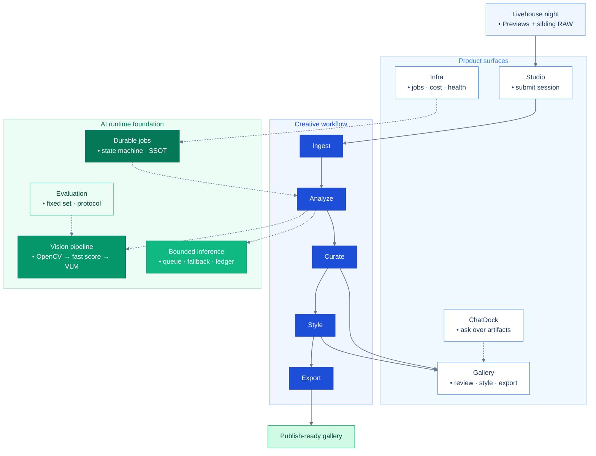
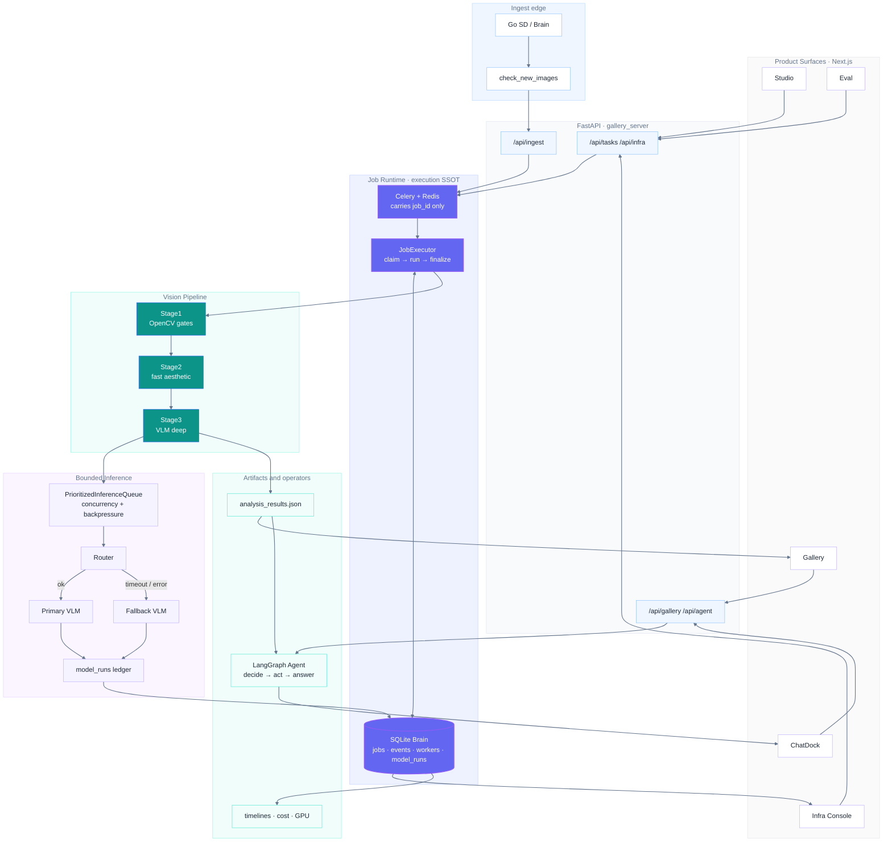

# LumaKernel


**AI creative assistant for livehouse photographers.**

LumaKernel helps turn thousands of concert photos into curated, publish-ready galleries — from session ingest and AI analysis through keeper selection, style, and export.

> Built from a real photographer workflow, not a toy AI demo.

Under the hood it is a **job-centric AI runtime** for batch vision: durable jobs, bounded VLM inference, model fallback, and an evaluation loop. That engineering layer exists so the creative workflow stays recoverable and honest — not as a platform product.

---

## System design

One loop: a livehouse night in → a publish-ready gallery out. Surfaces on top, creative workflow in the middle, durable AI runtime underneath.


```mermaid
flowchart TB
    classDef night fill:#EFF6FF,stroke:#60A5FA,color:#1E3A5F
    classDef ui fill:#FFFFFF,stroke:#3B82F6,color:#1E3A5F
    classDef flow fill:#1D4ED8,stroke:#1E40AF,color:#FFFFFF
    classDef runtimeDeep fill:#047857,stroke:#065F46,color:#FFFFFF
    classDef runtimeMid fill:#059669,stroke:#047857,color:#FFFFFF
    classDef runtimeSoft fill:#10B981,stroke:#059669,color:#FFFFFF
    classDef eval fill:#ECFDF5,stroke:#34D399,color:#064E3B
    classDef out fill:#D1FAE5,stroke:#10B981,color:#064E3B

    N["Livehouse night<br/>• Previews + sibling RAW"]

    subgraph SURFACES["Product surfaces"]
        direction LR
        ST["Studio<br/>• submit session"]
        GA["Gallery<br/>• review · style · export"]
        CH["ChatDock<br/>• ask over artifacts"]
        IC["Infra<br/>• jobs · cost · health"]
    end

    subgraph WORKFLOW["Creative workflow"]
        direction LR
        W1["Ingest"]
        W2["Analyze"]
        W3["Curate"]
        W4["Style"]
        W5["Export"]
        W1 --> W2 --> W3 --> W4 --> W5
    end

    subgraph RUNTIME["AI runtime foundation"]
        direction LR
        R1["Durable jobs<br/>• state machine · SSOT"]
        R2["Vision pipeline<br/>• OpenCV → fast score → VLM"]
        R3["Bounded inference<br/>• queue · fallback · ledger"]
        R4["Evaluation<br/>• fixed set · protocol"]
    end

    P["Publish-ready gallery"]

    N --> ST
    ST --> W1
    W2 -.-> R2
    W2 -.-> R3
    R1 -.-> W2
    W3 --> GA
    W4 --> GA
    CH -.-> GA
    W5 --> P
    IC -.-> R1
    R4 -.-> R2

    class N night
    class P out
    class ST,GA,CH,IC ui
    class W1,W2,W3,W4,W5 flow
    class R1 runtimeDeep
    class R2 runtimeMid
    class R3 runtimeSoft
    class R4 eval
    style SURFACES fill:#F0F9FF,stroke:#BFDBFE,color:#3B82F6
    style WORKFLOW fill:#EFF6FF,stroke:#93C5FD,color:#1D4ED8
    style RUNTIME fill:#ECFDF5,stroke:#A7F3D0,color:#047857
    linkStyle default stroke:#64748B,stroke-width:1.5px
```

<details>
<summary><strong>Reference run</strong> (Showcase Fixture)</summary>

| Metric | Value | Source |
|--------|------:|--------|
| Photos in | 412 | Showcase fixture |
| VLM calls (ledger) | 288 | `web/fixtures/infra-metrics.json` |
| Keep rate | 79% | Representative showcase (`RECORDED_OUTCOME`) |
| E2E (job `#61`) | ~12.5 min | `total_latency_ms` on `ANALYZE_SESSION` |

**Provenance:** label metrics **Live** · **Recorded Run** · **Simulated** · **Showcase Fixture**. Never present Simulated / Showcase numbers as production SLOs.

</details>

---

## Why this exists

Livehouse photography produces a familiar mess: one show can leave hundreds of near-identical frames — same song, same angle, different blink or blur. After **60+ shows and 30,000+ photos**, the bottleneck was never “can AI score an image?” It was the full path:

**shoot → cull similars → pick keepers → grade → export → publish**

Manual culling after a late set eats hours. A one-off VLM script can score a folder, but it does not survive crashes, explain cost, or fit a real review loop.

LumaKernel is the workflow the author actually needed: AI assists curation inside a durable session runtime, with Gallery review and export as first-class steps — at **personal / research project scale**, on a single machine.

The engineering questions that followed (and shaped the runtime):

1. Where is this session job in the state machine?
2. After a worker crash — resume without double-running?
3. Why did inference stall? Did primary → fallback fire?
4. Which VLM calls consumed cost / latency?
5. Does gating preserve quality vs full-VLM?

---

## Key features

- **AI photo curation** — session-level analysis that shortlists keepers from dense concert sets
- **Aesthetic ranking** — fast technical / aesthetic gates before expensive VLM work
- **Near-duplicate filtering** — cut redundant frames from the same moment
- **Bilingual commentary** — structured notes for review, not free-form chat fluff
- **Style processing** — grade confirmed selections before publish
- **Gallery export** — Previews paired with sibling `RAW/`
- **Assistant over artifacts** — Gallery ChatDock (LangGraph) searches, selects, styles, and exports against real session data
- **Operator visibility** — Infra Console for jobs, timelines, model attempts, and cost

This is **not** a general chatbot. Chat is a Gallery-scoped copilot over pipeline artifacts.

---

## Engineering highlights

Technical positioning: a **job-centric AI runtime** for batch vision — built so the photographer workflow above is recoverable, observable, and evaluable.

| Pillar | Meaning |
|--------|---------|
| **Durable jobs** | Claim / retry / dead-letter in SQL; Celery `AsyncResult` is not authoritative |
| **Bounded inference** | Prioritized queue with concurrency and backpressure |
| **Model fallback** | Primary → fallback with an attempt ledger |
| **E2E observability** | `job_events`, `model_runs`, Infra Console drill-down |

### Durable job runtime

A shell script that calls a VLM is not enough for a full session. LumaKernel treats each analyze run as a durable job:

- **State machine:** `QUEUED → CLAIMED → PREPROCESSING → INFERENCING → SUCCEEDED` (plus retry / dead-letter paths)
- **SQLite SSOT:** `jobs`, `job_events`, `workers`, `model_runs` — Celery only carries a `job_id`
- **Claim fences:** atomic claim; stale workers cannot overwrite a newer generation
- **Retry / DLQ:** retryable failures requeue; exhausted work becomes dead-lettered
- **Checkpoints / artifacts:** stage progress and `analysis_results.json` survive process death

**Success — job `#61`**

```text
QUEUED → CLAIMED → PREPROCESSING → INFERENCING → SUCCEEDED
```

**Fallback recovery — job `#62`**

```text
primary TIMEOUT → fallback SUCCEEDED → job SUCCEEDED (degraded)
```

Fixture: `web/fixtures/infra-job-detail-fallback.json`.

### Bounded VLM inference

VLM calls are expensive and flaky. Admission is explicit:

- **`PrioritizedInferenceQueue`** — concurrency caps; no unbounded parallel Ollama
- **Backpressure** — queue wait limits; overload fails closed rather than melting the GPU
- **Primary → fallback router** — timeout / error path recorded per attempt
- **`model_runs` ledger** — every attempt attributed for Infra timelines and cost

Optional swap: `model.use_inference_layer: true` → `inference/` (router, providers, ledger).

### Evaluation

Quality is measured on a fixed set, not vibes.

- UI: **`/eval`** · report index: [`reports/eval/meta.json`](reports/eval/meta.json)
- Fixed **250-image** human-labeled set (`data/eval/`)
- Full scoring: `configs/eval_stage3.yaml` (temp=0)
- Reports stamp a `protocol` block (seed, config hash, hardware, git sha) via `scripts/eval/protocol.py`
- Preference pairs (future SFT/DPO): `data/eval/preferences/`
- Agent eval: `data/eval/agent/` · `scripts/eval/eval_agent_*.py` · [`docs/AGENT_SLIM.txt`](docs/AGENT_SLIM.txt)

| Strategy | Quality | VLM calls | Notes | Source |
|----------|---------|----------:|-------|--------|
| Full VLM (eval Stage3) | Spearman **0.36** · MAE **6.09** · P@20 **0.55** | 100% of 250 | — | Recorded · `reports/eval/stage3_v6_qwen2vl_temp0.json` |
| Two-stage gating (prod path) | admitted Spearman **0.52** · MAE **4.48** · keeper coverage **0.06** | **6.4%** (16/250) | ~15× fewer VLM calls | Recorded · `reports/eval/two_stage_gating.json` |

**Simulated only** (not SLOs): `reports/eval/quant_compare_example.json`, `scripts/gpu_pressure_demo.py --simulate`.

```bash
python scripts/eval/sample_eval_set.py --session "<archive>/<YYYY-MM-DD>" \
    --target 250 --out data/eval/images --manifest data/eval/manifest.json
python run_pipeline.py --config configs/eval_stage3.yaml \
    --source-dir data/eval/images --no-serve --no-checkpoint
python scripts/label_server.py --images data/eval/images --labels data/eval/labels.jsonl
python scripts/eval_stage3.py run --labels data/eval/labels.jsonl \
    --predictions data/eval/images/analysis_results.json
python scripts/eval/eval_two_stage_gating.py --out reports/eval/two_stage_gating.json
python scripts/eval/export_preferences.py --labels data/eval/labels.jsonl
```

---

## Architecture


```mermaid
flowchart TB
    classDef surface fill:#FFFFFF,stroke:#C4B5FD,color:#1F2937
    classDef api fill:#EFF6FF,stroke:#93C5FD,color:#1F2937
    classDef core fill:#6366F1,stroke:#8B5CF6,color:#FFFFFF,stroke-width:2px
    classDef pipe fill:#0D9488,stroke:#2563EB,color:#FFFFFF
    classDef infer fill:#F5F3FF,stroke:#C4B5FD,color:#1F2937
    classDef out fill:#F0FDFA,stroke:#5EEAD4,color:#1F2937
    classDef edge fill:#FFFFFF,stroke:#93C5FD,color:#1F2937

    subgraph SURFACES["Product Surfaces  ·  Next.js"]
        direction LR
        ST[Studio]
        GA[Gallery]
        IC[Infra Console]
        EV[Eval]
        CH[ChatDock]
    end

    subgraph GATEWAY["FastAPI  ·  gallery_server"]
        direction LR
        R1["/api/ingest"]
        R2["/api/tasks  /api/infra"]
        R3["/api/gallery  /api/agent"]
    end

    subgraph INGEST["Ingest edge"]
        direction LR
        GO[Go SD / Brain]
        CK[check_new_images]
        GO --> CK
    end

    subgraph RUNTIME["Job Runtime  ·  execution SSOT"]
        CEL["Celery + Redis<br/>carries job_id only"]
        EX["JobExecutor<br/>claim → run → finalize"]
        SQL[("SQLite Brain<br/>jobs · events · workers · model_runs")]
        CEL --> EX
        EX <--> SQL
    end

    subgraph PIPE["Vision Pipeline"]
        direction LR
        S1["Stage1<br/>OpenCV gates"]
        S2["Stage2<br/>fast aesthetic"]
        S3["Stage3<br/>VLM deep"]
        S1 --> S2 --> S3
    end

    subgraph INFER["Bounded Inference"]
        Q["PrioritizedInferenceQueue<br/>concurrency + backpressure"]
        RT[Router]
        P[Primary VLM]
        FB[Fallback VLM]
        LD[model_runs ledger]
        Q --> RT
        RT -->|ok| P
        RT -->|timeout / error| FB
        P --> LD
        FB --> LD
    end

    subgraph OUT["Artifacts and operators"]
        direction LR
        AR[analysis_results.json]
        AG["LangGraph Agent<br/>decide → act → answer"]
        OP[timelines · cost · GPU]
    end

    ST --> R2
    GA --> R3
    IC --> R2
    EV --> R2
    CH --> R3
    CK --> R1
    R1 --> CEL
    R2 --> CEL
    R3 --> AG
    EX --> S1
    S3 --> Q
    LD --> SQL
    S3 --> AR
    AR --> GA
    AR --> AG
    SQL --> IC
    SQL --> OP
    AG --> CH

    class ST,GA,IC,EV,CH surface
    class R1,R2,R3 api
    class CEL,EX,SQL core
    class S1,S2,S3 pipe
    class Q,RT,P,FB,LD infer
    class AR,AG,OP out
    class GO,CK edge
    style SURFACES fill:#FAFAFA,stroke:#E5E7EB,color:#64748B
    style GATEWAY fill:#F8FAFC,stroke:#E2E8F0,color:#64748B
    style INGEST fill:#EFF6FF,stroke:#BFDBFE,color:#64748B
    style RUNTIME fill:#EEF2FF,stroke:#C7D2FE,color:#64748B
    style PIPE fill:#F0FDFA,stroke:#99F6E4,color:#64748B
    style INFER fill:#FAF5FF,stroke:#E9D5FF,color:#64748B
    style OUT fill:#F0FDFA,stroke:#99F6E4,color:#64748B
    linkStyle default stroke:#64748B,stroke-width:1.5px
```

**How to read it:** product surfaces hit FastAPI → ingest seeds durable jobs → executor runs Stage1→2→3 → VLM goes through a bounded queue with primary/fallback ledgered in SQLite → Gallery / Infra / Agent consume the same SSOT.

<details>
<summary><strong>Architecture details</strong> — control/data planes, main path, code map, ASCII overview</summary>

### Control plane vs data plane


```mermaid
flowchart LR
    classDef ctrl fill:#FFFFFF,stroke:#C4B5FD,color:#1F2937
    classDef data fill:#F0FDFA,stroke:#5EEAD4,color:#1F2937
    classDef ssot fill:#6366F1,stroke:#8B5CF6,color:#FFFFFF,stroke-width:2px

    subgraph CTRL["Control plane"]
        direction TB
        C1[Celery dispatch]
        C2[Job claim / retry / DLQ]
        C3[Queue admit + backpressure]
        C4[Infra Console · Golden Signals]
    end

    subgraph DATA["Data plane"]
        direction TB
        D1[Preview / RAW bytes]
        D2[Stage1 · Stage2 · Stage3]
        D3[VLM primary → fallback]
        D4[analysis_results.json]
    end

    SSOT[("SQLite SSOT<br/>jobs · job_events · model_runs")]

    CTRL -->|job_id only| SSOT
    DATA -->|scores · attempts · artifacts| SSOT
    SSOT -->|timelines · cost · status| CTRL

    class C1,C2,C3,C4 ctrl
    class D1,D2,D3,D4 data
    class SSOT ssot
    style CTRL fill:#FAF5FF,stroke:#E9D5FF,color:#64748B
    style DATA fill:#F0FDFA,stroke:#99F6E4,color:#64748B
    linkStyle default stroke:#64748B,stroke-width:1.5px
```

**Celery never owns truth** — it only wakes a worker with a `job_id`. Claim fences, retries, and model attempts live in SQLite.

### Linear main path

```text
ingest (Go SD/brain → sessions/photos)
  → POST /api/ingest/check_new_images
  → tasks.process_brain_ingested          # seed ANALYZE_SESSION
  → tasks.run_job(job_id)                 # Celery payload = job_id only
  → JobExecutor                           # atomic claim → run → finalize
  → PipelineStageRunner
       STAGE1_FILTER → STAGE2_FAST_SCORE → STAGE3_VLM
  → PrioritizedInferenceQueue + router    # primary → fallback
  → analysis_results.json + job_events + model_runs
```

### ASCII overview

```text
┌──────────────────────────────────────────────────────────────────────────┐
│                     PRODUCT  ·  Next.js                                  │
│   Studio     Gallery + ChatDock     Infra Console     Eval               │
└───────────────┬───────────────────────────┬──────────────────────────────┘
                │ FastAPI                   │ observe / export / chat
                ▼                           ▼
┌───────────────────────────┐    ┌─────────────────────────────────────────┐
│  INGEST                   │    │  ARTIFACTS + AGENT                      │
│  Go SD/Brain ──► seed     │    │  analysis_results.json                  │
│  ANALYZE_SESSION jobs     │    │  LangGraph: decide → act → answer       │
└─────────────┬─────────────┘    └──────────────────▲──────────────────────┘
              │                                     │
              ▼                                     │
┌───────────────────────────────────────────────────┴──────────────────────┐
│  JOB RUNTIME  (SQLite = SSOT, Celery only wakes worker with job_id)      │
│                                                                          │
│   Redis/Celery ──► JobExecutor ──► Stage1 → Stage2 → Stage3              │
│                         │              OpenCV   fast     VLM             │
│                         │                              │                 │
│                         │              ┌───────────────┴──────────────┐  │
│                         │              │ PrioritizedInferenceQueue    │  │
│                         │              │ primary ──timeout──► fallback│  │
│                         ▼              │         model_runs ledger    │  │
│                   jobs / events / workers / model_runs  ◄─────────────┘  │
└──────────────────────────────────────────────────────────────────────────┘
```

### Where to read code

| Layer | Start here |
|-------|------------|
| Job execution | `tasks/run_job.py` → `services/job_executor.py` → `services/processor/pipeline_stage_runner.py` |
| Ingest / dispatch | `tasks/ingest.py`, `services/scheduler/` |
| HTTP API | `gallery_server.py`, `api/` |
| Infra UI | `web/app/infra/page.tsx` |
| Gallery agent | `services/agent/conversation_graph.py` · [`docs/AGENT_SLIM.txt`](docs/AGENT_SLIM.txt) |
| Optional inference swap | `model.use_inference_layer: true` → `inference/` |

</details>

---

## Tech stack

| Layer | Choices |
|-------|---------|
| **Product** | Next.js, FastAPI (`gallery_server.py`) |
| **Workflow** | Celery, Redis, SQLite (`luma_brain.db`) |
| **AI** | VLM via Ollama / vLLM / OpenAI-compatible HTTP |
| **Agent** | LangGraph (Gallery ChatDock — decide → act → answer) |
| **Computer vision** | OpenCV (Stage1 gates + Stage2 fast aesthetic) |
| **Ingest** | Go (`cmd/ingest/`, preview / ARW extractors) |
| **Runtime** | Python 3.10+ |

---

## Project philosophy

**From photographer workflow to AI system design.**

This project did not start as “call a vision API.” It started as: after a livehouse night, how do you get from a card full of near-duplicates to a set you would actually publish — without losing hours, and without trusting a black-box score?

The answer was not a chatbot. It was a small, honest system:

- AI assists the creative loop (cull → rank → review → style → export)
- Jobs and inference are durable and bounded so long sessions do not vanish mid-run
- Metrics and a fixed eval set keep quality claims accountable
- Scope stays **single-node**, personal-archive, research/project scale — not a multi-tenant cloud platform

Hooks toward broader platform shape (`LIVEHOUSE_BRAIN_BACKEND`, content digests, scope quotas, optional OTEL) are scaffolding only. See [`docs/PLATFORM_SCOPE.txt`](docs/PLATFORM_SCOPE.txt).

---

## Quick start

**Requires:** Python 3.10+, Redis, Node 18+, Ollama (or compatible VLM HTTP API).  
**Optional:** Go ingest, exiftool, macOS `powermetrics`.

```bash
python -m venv .venv && source .venv/bin/activate
pip install -r requirements.txt
cp .env.example .env
# if API host/port differs:
cp web/.env.example web/.env.local
```

1. Edit `configs/livehouse.yaml` — `paths.source_dir`, `model.*`, optional `model.use_inference_layer`.
2. Full stack: `./start_all.sh` (or `./deploy/up.sh up --build`).
3. Pipeline-only (no job / Infra timeline):  
   `python run_pipeline.py --config configs/livehouse.yaml --source-dir "<previews>" --no-serve`
4. Open: Next.js <http://127.0.0.1:3000> · FastAPI <http://127.0.0.1:8080> · Infra `/infra`

---

## Configuration

| Area | Where |
|------|-------|
| Paths, thresholds, VLM / inference toggle | `configs/livehouse.yaml` |
| Celery broker / backend | `CELERY_BROKER_URL`, `CELERY_RESULT_BACKEND` |
| Worker pool label | `LIVEHOUSE_EXECUTOR_CLASS` (default `general`) |
| GPU telemetry | `LUMA_GPU_TELEMETRY_PATH` |
| Brain DB / archive | `LUMA_BRAIN_DB`, `LUMA_ARCHIVE_ROOT` |
| Agent runtime | `LIVEHOUSE_AGENT_RUNTIME` (default LangGraph) |

Secrets stay in `.env` (git-ignored). See `.env.example`.

---

## Scope

**Single-node AI runtime** for a personal creative workflow — not a multi-tenant cluster:

1. SQLite execution state (one machine, not a cluster DB)
2. In-process inference admission + bounded queue (not cluster-wide quotas)
3. Local archive paths for artifacts

---

## Layout

```text
configs/           livehouse.yaml + eval configs
tasks/             run_job, ingest, maintenance
services/          job_executor, processor/, scheduler/, agent/
engine/            LivehouseVLM, operators
inference/         optional router, providers, ledger
infra/             WorkerManager, metrics, gpu_telemetry
api/               gallery, infra, agent routes
gallery_server.py  FastAPI entry
web/               Studio · Gallery · Infra · Eval
cmd/               Go ingest + extractors
scripts/           eval harness, demos
data/eval/         fixed labels + agent cases
reports/eval/      Recorded Run JSON
docs/              PROJECT_GUIDE · PLATFORM_SCOPE · AGENT_SLIM
```

Deeper onboarding (中文): [`docs/PROJECT_GUIDE.txt`](docs/PROJECT_GUIDE.txt)  
Agent surface checklist: [`docs/AGENT_SLIM.txt`](docs/AGENT_SLIM.txt)  
Editor conventions: `.cursor/rules/*.mdc`, [`AGENTS.md`](AGENTS.md)

---

## License

[MIT](LICENSE) © postrockicecola
